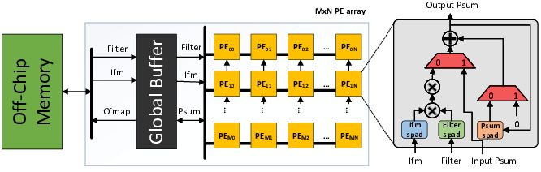

# SASiML: Spatial Architecture Simulator for Machine Learning

## Introduction

SASiML is a cycle-accurate simulator that mimics a Spatial Architecture for accelerating CNN inference and training workloads. SASiML is composed of two main parts:

1. The hardware simulator: it models all the components of the microarchitecture. The baseline architecture configuration mimics the  Eyeriss[1] architecture. 
2. The compiler: it generates all the hardware signals to control the hardware simulator.
 

## Cite SASiML

Please cite the following papers if you find SASiML useful:

[**"EcoFlow: Efficient Convolutional Dataflows for Low-Power Neural Network Accelerators"**](https://arxiv.org/pdf/2202.02310.pdf), Lois Orosa, Skanda Koppula, Yaman Umuroglu, Konstantinos Kanellopoulos,Juan G ́omez-Luna, Michaela Blott, Kees Vissers, Onur Mutlu, arXiv 2022

[**"EcoFlow: Efficient Convolutional Dataflows for Low-Power Neural Network Accelerators"**](https://ieeexplore.ieee.org/document/10119218), Lois Orosa, Skanda Koppula, Yaman Umuroglu, Konstantinos Kanellopoulos,Juan G ́omez-Luna, Michaela Blott, Kees Vissers, Onur Mutlu, IEEE Transactions on Computers 2023

LaTeX code:


```
@article{orosa2022ecoflow,
  title={EcoFlow: Efficient Convolutional Dataflowsfor Low-Power Neural Network Accelerators},
  author={Lois Orosa, Skanda Koppula, Yaman Umuroglu, Konstantinos Kanellopoulos,Juan G ́omez-Luna, Michaela Blott, Kees Vissers, and Onur Mutlu},
  journal={arXiv},
  year={2022}
}
```
```
@article{orosa2023ecoflow,
  title={EcoFlow: Efficient Convolutional Dataflowsfor Low-Power Neural Network Accelerators},
  author={Lois Orosa, Skanda Koppula, Yaman Umuroglu, Konstantinos Kanellopoulos,Juan G ́omez-Luna, Michaela Blott, Kees Vissers, and Onur Mutlu},
  journal={IEEE Transactions on Computers},
  year={2023}
}
```
## Installation

### Requirements

SASiML:
 * Python3 
 * importlib
 * Numpy
 
 DRAMPower:
 * xerces-c (libxerces-c-dev) - v3.1 with Xerces development package
 * gcc - v4.4.3

### SASiML

1. git clone https://github.com/CMU-SAFARI/sasiml

### DRAMPower

SASiML uses DRAMPower to calculate energy numbers. Install DRAMPower in the SASiML folder:

1. cd sasiml
2. git clone https://github.com/tukl-msd/DRAMPower
3. Follow the installation instructions in https://github.com/tukl-msd/DRAMPower/blob/master/README.md

### Example of compiling and executing one CNN layer

If you installed SASiML correctly, you should be able to compile and execute any CNN layer. For example:

```
$ cd compiler
$ python sac.py -i inputs/mobilenet_conv5.py -p igrad -t conv -o ../confs/mobilenet_conv5_conv.py
$ cd ..
$ python main.py mobilenet_conv5_conv
```


## SASiML Hardware Accelerator Simulator

The hardware accelerator simulates a Global Buffer, and an array of PEs like the one on the figure:



It also simulates the 4 networks on the simulator:

1. Ifmap network
2. Filter network
3. Ofmap network
4. Local psums network

One caviat is that the distribution of the data is not cycle-accurated simulated, to avoid complexity and simulation time. Instead, we make empirical calculations, which allows 1) decoupling data distribution from actual computations, which makes the simulator easier to hack, and 2)  saving storage (signal storage) and simulation time.

### Configuration

The configuration files should be placed at confs/. The configuration files define all the control signals of the hardware to work. These files are generated automatically by the SASiML compiler. 

### Execution
 
To execute the simulation defined by the configuration file, you need to execute the main python script followed by the name of the configuration (without the .py extension). For example:

```
$ python main.py mobilenet_conv5_conv

$ python main.py mobilenet_conv5_gflow
```

### Stats

The simulator generates 1) global stats and 2) per PE stats.

1. Global stats: they are stored in the folder 
```
/results
``` 
with the extension __.summary.stats__

2. PE stats: they are stored in the folder 

```
/results
``` 

with the extension __.stats__ 


## SASiML Compiler 

The compiler automatically generates the signals for the hardware simulator (in the form of configuration files, stored ).
compiler/inputs/alexnet/alexnet_conv1.py has some comments about each field.

### Execution 
The  parameters of the compiler are:

- **-i Input**: input configuration file defining the properties of the layer
- **-o Output**: output cinfiguration file. This file is the input of the hardware simulator
- **-p Pass**: Defines the pass to compile. The options are [**forward**] (default): forward pass , [**igrad**]: input gradient calculation and [**fgrad**]: filter gradient calculation.
- **-t Type**: defines the type of dataflow. The options are  [**conv**] (default): convolutions (ot transposed convolutions) using the row-stationary dataflow and  [**gflow**]: Grad-Flow (only compatible with -p [igrad or fgrad])

- **-a Architecture**: Defines the hardware architecture. The options are [**eyeriss**] (default): the eyeriss architecture[1] and [**newarch**]: a new architecture with the mux is connected in a different way (implemented on hardware, but not on the compiler yet).

Some examples of execution:

```
$ cd compiler

$ python sac.py -i inputs/mobilenet/mobilenet_conv5.py -p igrad -t conv -o ../confs/mobilenet_conv5_conv.py

$ python sac.py -i inputs/mobilenet/mobilenet_conv5.py -p igrad -t gflow -o ../confs/mobilenet_conv5_gflow-igrad.py

```

## License

Distributed under the MIT License. See LICENSE for more information

## Contact

Lois Orosa - lois.orosa.nogueira@gmail.com

## Acknowledgements

We acklowledge support from SAFARI Research Group's industrial partners.

## References 
[1] Chen, Yu-Hsin, Joel Emer, and Vivienne Sze. "Eyeriss: A spatial architecture for energy-efficient dataflow for convolutional neural networks." ACM SIGARCH Computer Architecture News. Vol. 44. No. 3. IEEE Press, 2016.
